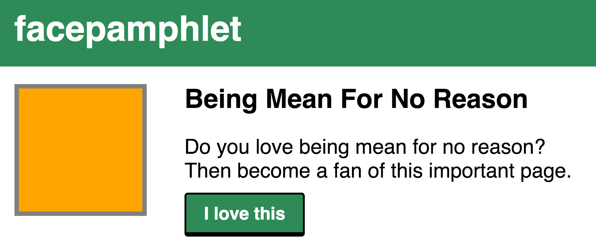
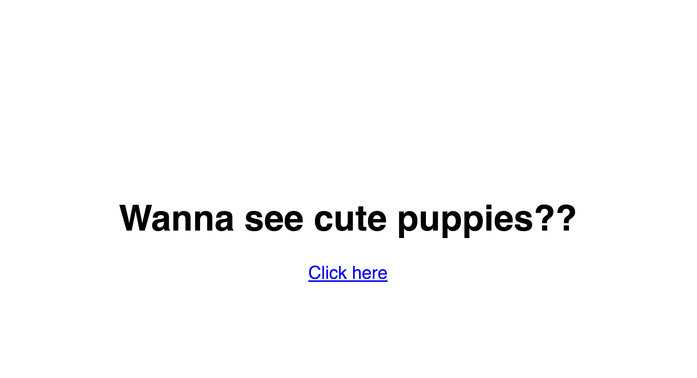
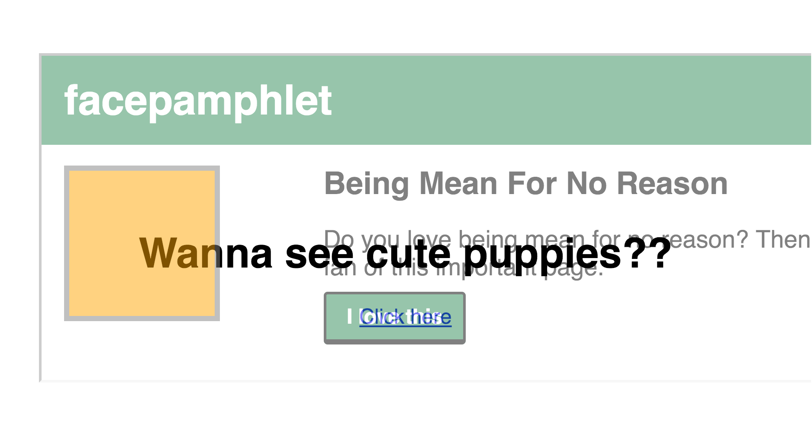

## Frameguard

`Frameguard`中间件通过设置`X-Frame-Options`头部可以减少点击劫持的攻击。

### 攻击

[点击劫持攻击](https://zh.wikipedia.org/wiki/点击劫持)是一种非常聪明的攻击方式。

攻击者想要终端用户去点击一些终端用户不想去点击的内容，这可以通过将一些超链接/按钮放置在某些内容的下面，通过这些内容诱导终端用户去点击来实现攻击。

假如我们现在进入了一个叫`Facepamphlet`的社交网站，然后我想要让你去点击如下页面上的“I love this”按钮



你可能永远不会点击"I love this"按钮，因为你是一个善良的人——你不是一个无缘无故乱生气的人（Being Mean For No Reason）。

假如我发给了你一个网站，上面有数百张可爱小狗的照片，这时你可能就会去点击某些内容去看看，毕竟可爱的小狗总是有吸引力的(￣ ▽ ￣)"

我发给你的网站页面可能是下面这个样子：


这时你可能去点击“Click here”超链接，然而你不知道的是，那里可能会有一个不可见的 iframe：

如果你点击了“Click here”，那我就成功的劫持了你的点击，并且将你的点击动作引导到对“I love this”按钮的点击。

点击劫持可被用于误导用户点击原本不想点击的内容。这可能包括在社交网络上无意的代言、点击广告等，如果攻击者够聪明的话，可能还会诱导你做些更危险的事情。

### HTTP 头部

HTTP 头部字段`X-Frame-Options`告诉浏览器禁止将你的网页放进 iframe 中。当浏览器加载 iframe 时，浏览器会检查 HTTP 头部`X-Frame-Options`字段的值，如果不允许放在 iframe 中，则会取消加载。

`X-Frame-Options`字段有三个选项：

- `X-Frame-Options: DENY` 将会阻止任何人通过 iframe 打开网页

- `X-Frame-Options: SAMEORIGIN` 允许同源网站通过 iframe 打开网页，这意味着你可以将你的一些网页放在 iframe 中进行展示，但是其他网站不能将你的网页放在 iframe 中展示。

- `X-Frame-Options: ALLOW-FROM http://example.com`允许网站`http://example.com`将你的网页放在 iframe 中展示（不幸的是，这里只能设置一个域名）

在上面说的例子中，`Facepamphlet`社交网站可以通过在 HTTP 头部设置`X-Frame-Options`的值为`DENY`来减少点击劫持的攻击，许多网站也都是这么做的。

如果你不希望你的网页被放在 iframe 中进行展示，最好将 HTTP 头部的`X-Frame-Options`的值设置为`DENY`或`SAMEORIGIN`，因为这样可以降低你的网站被攻击的风险。

注：有很多浏览器目前不支持`ALLOW-FROM`，如果你将`X-Frame-Options`的值设置为`ALLOW-FROM http://example.com`，对于不支持此值的浏览器，将会忽略此 HTTP 头部字段，那么你的网页就可以被放在 iframe 中展示了。

### 代码

`Helmet`的`Frameguard`中间件是一个相对来说比较简单的中间件，它会按照你为`X-Frame-Options`字段指定的任意值来设置 HTTP 头部。

你可以将`frameguard`模块作为`Helmet`的一部分来使用：

```javascript
const helmet = require('helmet');

app.use(helmet.frameguard({ action: 'sameorigin' }));
```

你也可以将其作为一个独立的模块使用：

```javascript
const frameguard = require('frameguard');

app.use(frameguard({ action: 'deny' }));
// 或
app.use(frameguard({ action: 'allow-from', domain: 'http://example.com' }));
```
